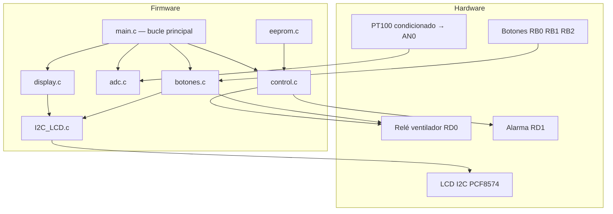
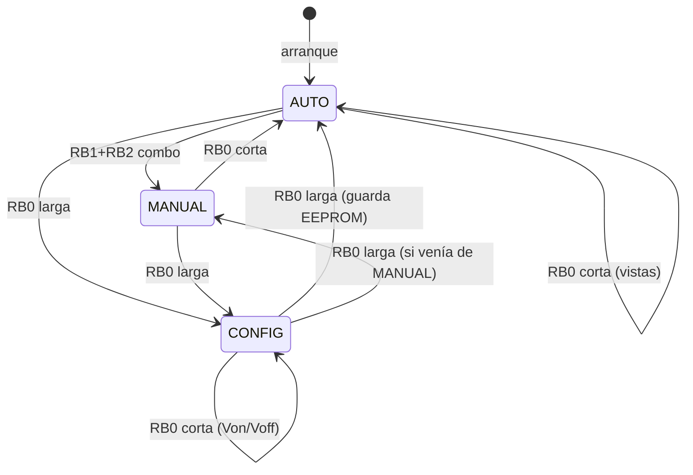

# Control y seguimiento de temperatura con PT100 — PIC16F877A

Firmware embebido para medir temperatura con sensor **PT100**, mostrar datos en **LCD 16×2 por I2C**, controlar un **ventilador con histéresis**, activar **alarma** por temperatura crítica y guardar **umbrales configurables** en EEPROM interna.

Proyecto **Digitales 2 (UNI)**.

## Características

- Lectura de temperatura por ADC (AN0) con conversión lineal 25–60 °C
- Modos **AUTO**, **MANUAL** y **CONFIG** con botones en PORTB
- Histéresis del ventilador (Von/Voff) persistente en EEPROM
- Alarma a partir de 58 °C con indicación en LCD y salida RD1
- Vistas de temperatura máxima y mínima en modo AUTO
- Formateo manual en LCD (sin `printf`) para ahorrar RAM del PIC16F877A
- Recuperación de bus I2C ante bloqueo por ruido del relé

---

## Parámetros del sistema

| Parámetro | Valor |
|-----------|-------|
| Microcontrolador | PIC16F877A |
| Compilador | XC8 v3.10 (MPLAB X / CMake) |
| Oscilador | Cristal XT **6 MHz** (`_XTAL_FREQ = 6000000UL`) |
| Entrada de temperatura | AN0 (RA0), ADC 10 bits |
| Display | I2C — `I2C_LCD.c` (RC3 SCL, RC4 SDA, dirección `0x4E`) |
| Ventilador | RD0 (optoacoplador, lógica invertida) |
| Alarma | RD1 (activo en alto) |
| Botones | RB0 MODE, RB1 UP, RB2 DOWN (activos en bajo) |

---

## Visión general

El firmware implementa un **controlador de temperatura** con tres modos (`AUTO`, `MANUAL`, `CONFIG`), lectura periódica del sensor vía ADC, visualización en LCD 16×2 por I2C, control de ventilador con histéresis, alarma por temperatura crítica y persistencia de umbrales en EEPROM interna.



### Arquitectura del firmware

| Módulo | Archivos | Responsabilidad |
|--------|----------|-----------------|
| Principal | `main.c` | Arranque, ISR Timer0, bucle infinito |
| Configuración | `config.h` | Constantes, pines, tipos, variables globales `extern` |
| ADC | `adc.c`, `adc.h` | Lectura AN0 y conversión V → °C |
| Control | `control.c`, `control.h` | Histéresis ventilador (AUTO) y alarma |
| Botones | `botones.c`, `botones.h` | Debounce, modos, ventilador manual, CONFIG |
| Pantalla | `display.c`, `display.h` | Textos LCD sin `printf` |
| EEPROM | `eeprom.c`, `eeprom.h` | Persistencia Von / Voff |
| LCD I2C | `I2C_LCD.c`, `I2C_LCD.h` | Driver MSSP + PCF8574, recuperación de bus |
| LCD paralelo (legado) | `lcd.c`, `lcd.h` | **No compilado** — conflicto con botones en PORTB |

Los módulos **no usan callbacks**; comparten estado global declarado en `config.h` y definido en `main.c`.

---

## Hardware y pines

| Pin | Dirección | Función |
|-----|-----------|---------|
| **RA0 (AN0)** | Entrada analógica | Voltaje PT100 condicionado (0–5 V ≈ 25–60 °C) |
| **RB0** | Entrada, activo en bajo | MODE — vistas, modos, CONFIG |
| **RB1** | Entrada, activo en bajo | UP — ventilador ON (MANUAL) / subir umbral (CONFIG) |
| **RB2** | Entrada, activo en bajo | DOWN — ventilador OFF (MANUAL) / bajar umbral (CONFIG) |
| **RC3 / RC4** | I2C SCL / SDA | Bus I2C → PCF8574 @ `0x4E` |
| **RD0** | Salida | Ventilador vía optoacoplador + transistor + relé |
| **RD1** | Salida | Alarma |

- Pull-ups internos PORTB: habilitados (`OPTION_REGbits.nRBPU = 0`).

### Sensor y conversión (`adc.c`)

- Mapeo lineal: 0 V → 25 °C, 5,0075 V → 60 °C (saturación entre ambos).
- Lectura ADC justificada a la derecha: `(ADRESH & 0x03) << 8 | ADRESL`.

\[
V = \frac{lectura \times 5{,}0}{1023}, \quad T = 25 + V \times \frac{35}{5{,}0075}
\]

### EEPROM interna

| Dirección | Contenido |
|-----------|-----------|
| 0x00 | Byte mágico `0xA5` |
| 0x01 | Von (°C) |
| 0x02 | Voff (°C) |

**Por defecto:** Von = 50 °C, Voff = 35 °C (histéresis 15 °C).

---

## Variables globales (estado del sistema)

| Variable | Tipo | Significado |
|----------|------|-------------|
| `modo_actual` | `Modo_t` | `MODO_AUTO`, `MODO_MANUAL` o `MODO_CONFIG` |
| `modo_anterior` | `Modo_t` | Modo guardado al entrar a CONFIG |
| `vista_actual` | `Vista_t` | En AUTO: `NORMAL`, `MAX` o `MIN` |
| `campo_edit` | `EditCampo_t` | En CONFIG: `EDIT_VON` o `EDIT_VOFF` |
| `fan_on` | `uint8_t` | Lógica software: 1 = ventilador encendido |
| `t_von` / `t_voff` | `int8_t` | Umbrales histéresis (°C, EEPROM) |
| `temperatura_actual` | `float` | °C del ADC |
| `voltaje_actual` | `float` | Voltios en AN0 |
| `temp_max` / `temp_min` | `float` | Histórico sesión (vistas MAX/MIN) |
| `alarma_activa` | `uint8_t` | 1 si T ≥ 58 °C |
| `alarma_parpadeo` | `uint8_t` | Toggle cada tick (~50 ms) para parpadeo LCD |
| `advertencia_activa` | `uint8_t` | 1 si valor CONFIG inválido |
| `advertencia_count` | `uint16_t` | Ocultar advertencia tras ~2000 llamadas a `leer_botones()` |
| `flag_timer` | `volatile uint8_t` | 1 cada ~50 ms (ISR Timer0) |
| `lcd_necesita_update` | `uint8_t` | 1 = refrescar LCD en el bucle principal |

---

## Temporización

### Timer0 (ISR)

- Fosc = 6 MHz → ciclo instrucción = Fosc/4.
- Prescaler **1:256**, recarga **TMR0 = 250** → ~1 ms por desborde.
- Tras **50 desbordes** → `flag_timer = 1` (**≈ 50 ms**).
- La ISR solo incrementa contadores; no toca LCD, botones ni relé.

### Bucle principal (`main.c`)

```
1. leer_botones()
2. Si flag_timer:
     ADC + temperatura + min/max
     control_histeresis()
     control_alarma()
     lcd_necesita_update = 1
3. Si lcd_necesita_update:
     actualizar_LCD()   ← bloquea ~20–40 ms (I2C)
4. leer_botones()      ← segunda lectura tras LCD
5. __delay_ms(1)
```

El debounce de botones cuenta **llamadas a `leer_botones()`**, no ms exactos.

### Flag `lcd_necesita_update`

| Pone en **1** | Pone en **0** |
|---------------|---------------|
| Cada tick de `flag_timer` (~50 ms) | `actualizar_LCD()` al terminar |
| Cambios de modo, vista, campo, umbrales, `fan_on` (`botones.c`) | |

---

## Salida RD0 — relé del ventilador (lógica invertida)

| Señal RD0 | Opto / Q1 | Relé | `fan_on` |
|-----------|-----------|------|----------|
| **0** (`FAN_ON_VAL`) | Q1 conduce | **ON** | 1 |
| **1** (`FAN_OFF_VAL`) | Q1 no conduce | **OFF** | 0 |

```c
#define FAN_PIN      PORTDbits.RD0
#define FAN_ON_VAL   0
#define FAN_OFF_VAL  1
```

**Arranque:** `FAN_PIN = FAN_OFF_VAL` → relé apagado.

### Quién escribe RD0

| Origen | Condición | Resultado |
|--------|-----------|-----------|
| `control_histeresis()` | Solo **MODO_AUTO**, T > Von | `fan_on=1`, RD0=0 |
| `control_histeresis()` | Solo **MODO_AUTO**, T < Voff | `fan_on=0`, RD0=1 |
| `control_histeresis()` | AUTO y V < 2,0 V | Apaga siempre (sensor inválido) |
| `control_histeresis()` | MANUAL / CONFIG | **No ejecuta** (return al inicio) |
| `botones.c` | MANUAL, RB1 ↑ | `fan_on=1`, RD0=0 |
| `botones.c` | MANUAL, RB2 ↑ | `fan_on=0`, RD0=1 |

### Histéresis AUTO (defaults)

| Umbral | Temperatura | Voltaje aprox.* |
|--------|-------------|-----------------|
| Von | Enciende si **T > Von** (50 °C) | ~3,58 V |
| Voff | Apaga si **T < Voff** (35 °C) | ~1,43 V |
| Entre ambos | Mantiene estado | — |
| Seguridad | V < 2,0 V → OFF | < 2,0 V |

\* \( V = \frac{(T - 25) \times 5{,}0075}{35} \)

---

## Salida RD1 — alarma

| Condición | `alarma_activa` | RD1 |
|-----------|-----------------|-----|
| T ≥ 58 °C | 1 | Alto |
| T < 56 °C (con alarma activa) | 0 | Bajo |
| Con alarma activa | toggle ~50 ms | Parpadeo LCD |

La alarma **prioriza** sobre cualquier pantalla en `actualizar_LCD()`.

---

## Modos de operación



### AUTO

- Ventilador: ON si T > Von; OFF si T < Voff; entre ambos mantiene estado.
- **MODE corta:** vista NORMAL → MAX → MIN → NORMAL.
- **RB1 + RB2:** pasa a MANUAL (una vez por combo).

### MANUAL

- **UP (RB1):** `fan_on=1`, RD0=0, delay 5 ms, refresco LCD.
- **DOWN (RB2):** `fan_on=0`, RD0=1, delay 5 ms, refresco LCD.
- **MODE corta:** vuelve a AUTO.
- La histéresis **no modifica** el ventilador en este modo.

### CONFIG

- **MODE larga:** entra desde AUTO o MANUAL (guarda `modo_anterior`).
- **MODE corta:** alterna campo Von ↔ Voff (`*` marca activo).
- **UP/DOWN:** ±1 °C en campo activo.
- Restricciones: 26–59 °C, Von − Voff ≥ 5 °C.
- Valor inválido: mensaje ~2 s, no aplica el cambio.
- **MODE larga de nuevo:** guarda EEPROM y restaura modo anterior.

---

## Botones — diagnóstico detallado (`botones.c`)

### Lectura y debounce

Botones activos en bajo. Debounce en **3 llamadas estables**:

1. Si el pin cambió → contador debounce = 0; si no, incrementa hasta 3.
2. Guarda `*_was_stable` (estado estable del ciclo anterior).
3. Si `debounce == 3` → actualiza `*_stable`.

- **Flanco ascendente:** `rb*_stable && !rb*_was_stable`
- **Flanco descendente:** `!rb*_stable && rb*_was_stable`

### RB0 — MODE corta vs larga

| Tipo | Detección | Umbral |
|------|-----------|--------|
| **Larga** | RB0 estable, `rb0_hold_count++` | ≥ **300** llamadas |
| **Corta** | Flanco descendente sin hold | Al soltar RB0 |

> 300 ticks no son 300 ms reales si el LCD bloquea el bucle. Ajustar umbral (p. ej. 80) si la larga se confunde con corta.

### Combo RB1 + RB2 (solo AUTO)

- Ambos estables → **MODO_MANUAL** una vez (`rb12_fired`).
- `combo_fired_this_tick` evita flancos UP/DOWN en el mismo ciclo.
- Al soltar uno → `rb12_fired = 0`.

### Tabla resumen: acción → variables → LCD → RD0

| Acción | Modo | Cambios | LCD | RD0 |
|--------|------|---------|-----|-----|
| T > Von | AUTO | `fan_on=1` | FAN:ON AUTO | 0 (ON) |
| T < Voff | AUTO | `fan_on=0` | FAN:OFF AUTO | 1 (OFF) |
| V < 2 V | AUTO | apaga ventilador | FAN:OFF AUTO | 1 (OFF) |
| RB0 corta | AUTO | cicla vista | MAX/MIN/NORMAL | — |
| RB0 larga | AUTO/MANUAL | → CONFIG | Von/Voff | — |
| RB1+RB2 | AUTO | → MANUAL | T + FAN | — |
| RB1 | MANUAL | `fan_on=1` | FAN: ON | 0 (ON) |
| RB2 | MANUAL | `fan_on=0` | FAN: OFF | 1 (OFF) |
| RB0 corta | MANUAL | → AUTO | V/T AUTO | según histéresis |
| RB1/RB2 | CONFIG | ±1 °C | umbrales / INVALIDO | — |
| RB0 larga | CONFIG | EEPROM + salir | según modo | según modo |
| T ≥ 58 °C | cualquiera | alarma | ALERTA parpadeo | RD1=1 |

---

## LCD (`display.c` + `I2C_LCD.c`)

### Cadena I2C

```
actualizar_LCD() / LCD_Clear()
    → LCD_Write_String / LCD_CMD  [I2C_LCD.c]
    → IO_Expander_Write → MSSP (RC3/RC4)
    → PCF8574 @ 0x4E → HD44780
```

- Cada carácter = varias transacciones I2C (~20–40 ms pantalla completa).
- **Recuperación de bus:** timeout en `I2C_Master_Wait()` + `I2C_Bus_Recovery()` (9 pulsos SCL + STOP + re-init) ante ruido del relé.
- **Sin `printf`:** formateo manual para ahorrar RAM.

| Formato | Función |
|---------|---------|
| Temperatura `XX.X` | `float_to_str_1dec()` |
| Voltaje `X.XXX` | `float_to_str_3dec()` |
| Umbrales Von/Voff | `u8_to_str2()` + concatenación |
| Cadenas fijas | Literales a `LCD_Write_String()` |

### Pantallas (prioridad: Alarma > CONFIG > MANUAL > AUTO)

| Estado | Línea 1 | Línea 2 |
|--------|---------|---------|
| Alarma (parpadeo ON) | `  ALERTA TEMP!  ` | `   !! CRITICO!! ` |
| Alarma (parpadeo OFF) | *(LCD_Clear — blanco)* | |
| CONFIG normal | `*Von:50  Voff:35` | `UP/DN ajusta    ` |
| CONFIG inválido | `  VALOR INVALIDO` | `Von-Voff >= 5C! ` |
| MANUAL | `T:xx.xC  MANUAL  ` | `FAN: ON         ` / `FAN: OFF        ` |
| AUTO normal | `V:x.xxxV T:xx.xC` | `FAN:ON  AUTO    ` / `FAN:OFF AUTO    ` |
| AUTO MAX | `  Temp. MAXIMA  ` | `    xx.x C      ` |
| AUTO MIN | `  Temp. MINIMA  ` | `    xx.x C      ` |

### Arranque — `animacion_inicio()`

1. `PT100 Sistema` en línea 1.
2. Barra `#` en línea 2 (100 ms/carácter).
3. Pausa 500 ms → `LCD_Clear()`.

---

## Flujo de arranque

1. Puertos (A/B/C entradas; D salidas; RD0=1 relé OFF).
2. ADC canal 0.
3. I2C y LCD.
4. Animación de inicio.
5. Carga umbrales EEPROM.
6. Timer0 e interrupciones.
7. Primera lectura ADC (inicializa T, V, min, max).

---

## Problemas conocidos

### Relé / motor y bloqueo aparente del PIC

Al conmutar el relé en MANUAL: LCD con luz pero sin texto, botones sin respuesta.

**Causa:** ruido eléctrico bloquea I2C en `while` infinito.

**Mitigación firmware:** timeout + `I2C_Bus_Recovery()`, doble `leer_botones()`, delay 5 ms tras cambiar RD0.

**Hardware recomendado:** diodo flyback, desacoplo Vdd, alimentación separada del relé, I2C lejos del cable del relé.

### `fan_on` vs RD0

- `fan_on` = estado lógico y texto LCD.
- `FAN_PIN` = nivel físico invertido (0=ON, 1=OFF).

---

## Compilación y build

### Archivos compilados

`main.c`, `adc.c`, `botones.c`, `control.c`, `display.c`, `eeprom.c`, `I2C_LCD.c`

### `lcd.c` excluido del build

Driver paralelo en PORTB (RB0–RB5) no se enlaza (conflicto con botones).

| Ubicación | Detalle |
|-----------|---------|
| `nbproject/configurations.xml` | `lcd.c` con `excluded="true"` |
| `cmake/.../user.cmake` | Elimina `lcd.c` de CMake |
| `.vscode/Digitales2_Proy_final.mplab.json` | `fileSets` sin `lcd.c` |

Abrir el proyecto en MPLAB X y ejecutar **Clean and Build**. En el log no debe aparecer `lcd.p1`.

### Salida

`out/Digitales2_Proy_final/default.elf` (y `.hex`)

---

## VS Code / análisis estático

| Archivo | Propósito |
|---------|-----------|
| `.vscode/c_cpp_properties.json` | Perfil XC8, `__XC8`, compiler xc8 v3.10 |
| `.vscode/settings.json` | clangd MPLAB; `--suppress-diag=main_returns_nonint` |
| `main.c` | `#undef main` para XC8 |

`void main(void)` es válido en PIC8 con XC8.

**Simulador:** usar **6 MHz**, no 1 MHz.

### `_XTAL_FREQ`

Definido en `config.h` como `6000000UL`. `I2C_LCD.h` usa `#ifndef _XTAL_FREQ` para evitar redefinición. `I2C_LCD.c` incluye `config.h` primero.

---

## Correcciones aplicadas

| Problema | Solución |
|----------|----------|
| Flancos de botones no detectados | Estado estable `rb*_stable` / `rb*_was_stable` |
| ADC con bits basura en ADRESH | Máscara `(ADRESH & 0x03)` |
| Mensaje «VALOR INVALIDO» no expiraba | `advertencia_count` → `uint16_t` |
| `lcd.c` compilado sin uso | Exclusión en build |
| Linker: RAM insuficiente (printf) | Formateo manual en `display.c` |
| Lógica relé invertida | `FAN_ON_VAL=0`, `FAN_OFF_VAL=1` |
| Histéresis pisa MANUAL | `if (modo_actual != MODO_AUTO) return` en `control_histeresis()` |
| LCD bloquea botones | `lcd_necesita_update`, doble `leer_botones()` |
| I2C colgado por ruido relé | Timeout + `I2C_Bus_Recovery()` |
| Combo RB1+RB2 repetido | Flag `rb12_fired` |
| Cristal 6 MHz | `_XTAL_FREQ=6000000UL`, TMR0=250 |

---

## Estructura del repositorio

```
├── main.c, config.h
├── adc.c / adc.h
├── control.c / control.h
├── botones.c / botones.h
├── display.c / display.h
├── eeprom.c / eeprom.h
├── I2C_LCD.c / I2C_LCD.h
├── lcd.c / lcd.h          # Legado, no en build
├── nbproject/
├── cmake/
├── .vscode/
└── README.md
```

---

## Pruebas recomendadas

1. AUTO: histéresis y vistas MAX/MIN (MODE corta).
2. MANUAL: UP/DOWN ventilador; salida con MODE corta; verificar que RD0 no se pisa.
3. CONFIG: MODE larga, Von/Voff, mensaje inválido ~2 s, persistencia EEPROM.
4. Alarma ≥ 58 °C (LCD parpadeo, RD1 alto).
5. Relé ON en MANUAL: LCD y botones siguen respondiendo.
6. Compilación sin `lcd.p1` ni errores de RAM por printf.
7. Corte ventilador AUTO con V < 2 V (sensor desconectado).

---

## Referencia rápida de constantes

| Constante | Valor |
|-----------|-------|
| `_XTAL_FREQ` | 6 000 000 Hz |
| TMR0 reload | 250 |
| Timer0 tick (`flag_timer`) | ~50 ms |
| Debounce botones | 3 llamadas estables |
| Hold RB0 (CONFIG) | 300 llamadas estables |
| Von / Voff default | 50 °C / 35 °C |
| Histéresis mínima CONFIG | 5 °C |
| Rango CONFIG | 26–59 °C |
| Alarma ON / OFF | 58 °C / 56 °C |
| Corte ventilador por V | < 2,0 V (solo AUTO) |
| LCD I2C | 0x4E, 100 kHz |
| `FAN_ON_VAL` / `FAN_OFF_VAL` | 0 / 1 |
